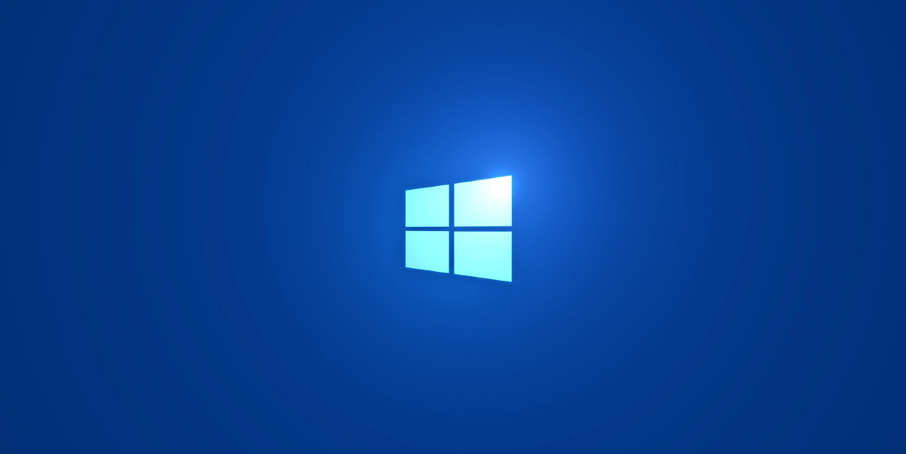

<!--truncate-->

## Clean Install
When buying a new windows laptop, one of the first things I do is clean install to avoid the bloatware that is preloaded.

Download Windows 10/11 installation media
- [Windows 10](https://go.microsoft.com/fwlink/?LinkId=691209)
- [Windows 11](https://go.microsoft.com/fwlink/?linkid=2156295)

To clean install you will need the following:
- An internet connection
- Sufficient data storage available on a computer, USB or external drive for the download.
- A blank USB flash drive with at least 8GB

Once downloaded, You should be greeted with the following screen. Follow the instructions to create the media. 

## Tools
After a clean installation of Windows I like to ensure I have tools to start any project. 
#### Applications
- [Chrome](https://www.google.com/chrome/) or [Edge](https://www.microsoft.com/en-us/edge?form=MA13FJ) which is installed by default
- [Visual Studio](https://code.visualstudio.com/)
- [Git](https://git-scm.com/)

#### Languages
- [Nodejs](https://nodejs.org/en/)
- [Java](https://www.azul.com/downloads/)
- [Python](https://www.python.org/downloads/)
- [.Net](https://dotnet.microsoft.com/en-us/download)
- [Azure CLI](https://learn.microsoft.com/en-us/cli/azure/install-azure-cli)
